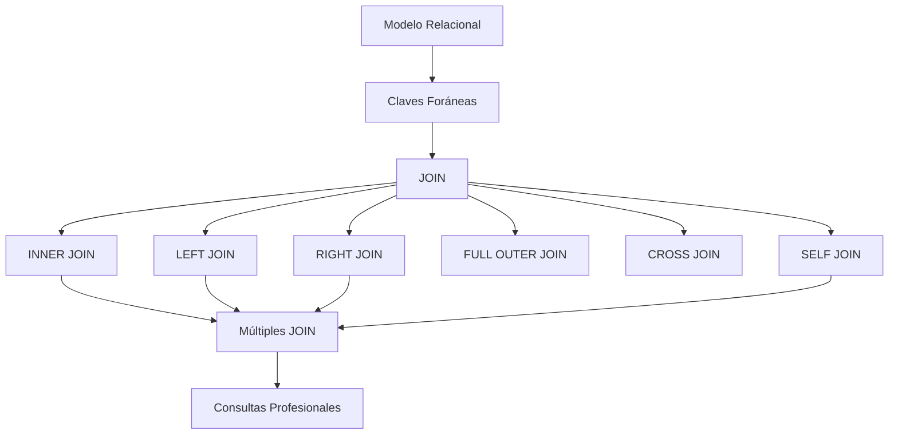

# Resumen

## Introducción

Con esta clase hemos alcanzado uno de los hitos más importantes del curso.

Hasta ahora todas las consultas trabajaban sobre una única tabla. A partir de este momento somos capaces de combinar información distribuida en múltiples tablas relacionadas, aprovechando la verdadera potencia del modelo relacional.

Los `JOIN` constituyen una de las herramientas más utilizadas por administradores de bases de datos, analistas de datos y desarrolladores de aplicaciones.

---

## Resumen de la clase

Comenzamos comprendiendo por qué existen los `JOIN` y cómo el proceso de normalización obliga a distribuir la información entre diferentes tablas relacionadas mediante claves primarias y claves foráneas.

Recordamos el funcionamiento de las **claves foráneas** y su papel en la integridad referencial, entendiendo que los `JOIN` aprovechan esas relaciones para reconstruir la información durante la consulta.

Posteriormente estudiamos el ​**producto cartesiano**​, base conceptual de todas las operaciones de unión.

A continuación analizamos los principales tipos de `JOIN`:

* `INNER JOIN`, que devuelve únicamente las filas relacionadas.
* `LEFT JOIN`, que conserva todas las filas de la tabla izquierda.
* `RIGHT JOIN`, que conserva todas las filas de la tabla derecha.
* `FULL OUTER JOIN`, estudiado desde un punto de vista teórico y mediante su alternativa en MySQL utilizando `UNION`.
* `CROSS JOIN`, utilizado para obtener el producto cartesiano de forma explícita.
* `SELF JOIN`, que permite relacionar una tabla consigo misma para representar estructuras jerárquicas.

Después aprendimos a construir consultas con múltiples tablas, siguiendo el recorrido natural del modelo relacional, y vimos una serie de buenas prácticas que mejoran la legibilidad, el mantenimiento y el rendimiento de las consultas.

Finalmente resolvimos un caso práctico completo y una colección de ejercicios incrementales que integran todos los conceptos estudiados.

---

## Mapa conceptual

---

## Competencias adquiridas

Al finalizar esta clase el estudiante es capaz de:

* comprender la necesidad de los `JOIN` en una base de datos relacional;
* identificar correctamente las relaciones entre tablas;
* utilizar `INNER JOIN`, `LEFT JOIN`, `RIGHT JOIN`, `CROSS JOIN` y `SELF JOIN`;
* comprender el funcionamiento de `FULL OUTER JOIN` y sus alternativas en MySQL;
* construir consultas que relacionan múltiples tablas;
* combinar `JOIN` con `WHERE`, `GROUP BY`, `HAVING` y `ORDER BY`;
* interpretar correctamente relaciones uno a uno, uno a muchos y muchos a muchos;
* escribir consultas con una estructura clara utilizando alias y buenas prácticas.

---

## Errores que ya debemos evitar

Después de esta clase deberíamos evitar errores como:

* generar productos cartesianos de forma accidental;
* unir columnas que no representan la misma relación;
* utilizar un tipo de `JOIN` incorrecto;
* escribir consultas largas sin alias;
* abusar de `SELECT *`;
* olvidar que una relación uno a muchos puede generar varias filas para un mismo registro.

Corregir estos errores desde el principio facilitará el desarrollo de consultas mucho más complejas.

---

## Relación con la siguiente clase

Ya sabemos recuperar información de varias tablas.

El siguiente paso consiste en responder preguntas que no pueden resolverse únicamente mediante `JOIN`.

Por ejemplo:

* ¿Qué clientes han realizado un número de pedidos superior a la media?
* ¿Cuál es el producto más caro de cada categoría?
* ¿Qué empleados venden por encima del promedio de la empresa?
* ¿Qué clientes nunca han comprado determinados productos?

Estas consultas requieren que el resultado de una consulta se utilice dentro de otra.

Para ello estudiaremos uno de los temas más potentes de SQL:

* subconsultas;
* consultas anidadas;
* operadores `IN`, `EXISTS`, `ANY` y `ALL`;
* subconsultas correlacionadas.

Con este nuevo bloque el estudiante comenzará a desarrollar consultas de nivel profesional.

---

## Ideas clave

* Los `JOIN` permiten reconstruir información distribuida entre múltiples tablas.
* `INNER JOIN` y `LEFT JOIN` son los tipos más utilizados en el desarrollo profesional.
* Comprender el modelo relacional es tan importante como conocer la sintaxis de SQL.
* El uso correcto de alias y una estructura clara mejora la calidad y el mantenimiento del código.
* Dominar los `JOIN` constituye uno de los requisitos fundamentales para abordar consultas avanzadas con subconsultas, vistas y optimización.

