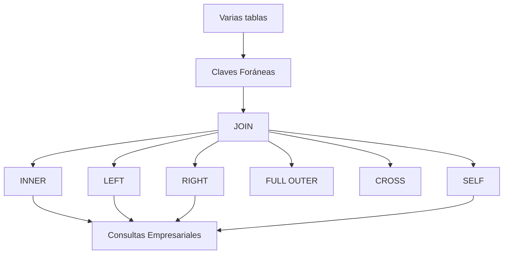

# Clase 19. SQL Avanzado: JOIN

## Introducción

Hasta este momento todas nuestras consultas han trabajado sobre ​**una única tabla**​.

Sin embargo, una base de datos relacional correctamente diseñada distribuye la información entre múltiples tablas relacionadas mediante claves primarias y claves foráneas.

Por ejemplo:

* un cliente realiza muchos pedidos;
* un pedido contiene varios productos;
* un producto pertenece a una categoría;
* un empleado trabaja en un departamento;
* un departamento pertenece a una sede.

Si toda esta información estuviera almacenada en una única tabla aparecerían enormes problemas de redundancia, inconsistencias y dificultad de mantenimiento.

Precisamente por ello diseñamos modelos relacionales normalizados.

Pero esta decisión plantea una nueva necesidad:

> **¿Cómo recuperamos información que está repartida entre varias tablas?**

La respuesta es mediante las operaciones ​**JOIN**​.

Los `JOIN` constituyen uno de los conceptos más importantes de SQL y probablemente el tema que más diferencia a un usuario principiante de uno avanzado.

A partir de esta clase aprenderemos a reconstruir la información distribuida entre distintas tablas y a elaborar consultas similares a las utilizadas diariamente en aplicaciones empresariales.

---

## Objetivos

Al finalizar esta clase el estudiante será capaz de:

* comprender por qué existen los JOIN;
* relacionar tablas mediante claves foráneas;
* entender el producto cartesiano;
* utilizar correctamente `INNER JOIN`;
* utilizar `LEFT JOIN`;
* utilizar `RIGHT JOIN`;
* comprender por qué MySQL no implementa `FULL OUTER JOIN`;
* utilizar `CROSS JOIN`;
* realizar `SELF JOIN`;
* construir consultas con múltiples tablas;
* aplicar buenas prácticas en consultas complejas.

---

## Índice

1. [¿Por qué necesitamos los JOIN?](01_por_que_necesitamos_los_join.md)
2. [Recordando las claves foráneas](02_recordando_las_claves_foraneas.md)
3. [Producto cartesiano](03_producto_cartesiano.md)
4. [INNER JOIN](04_inner_join.md)
5. [LEFT JOIN](05_left_join.md)
6. [RIGHT JOIN](06_right_join.md)
7. [FULL OUTER JOIN y sus alternativas](07_full_outer_join_y_sus_alternativas.md)
8. [CROSS JOIN](08_cross_join.md)
9. [SELF JOIN](09_self_join.md)
10. [JOIN de múltiples tablas](10_join_de_multiples_tablas.md)
11. [Buenas prácticas al usar JOIN](11_buenas_practicas_al_usar_join.md)
12. [Errores frecuentes](12_errores_frecuentes.md)
13. [Caso práctico empresa](13_caso_practico_empresa.md)
14. [Ejercicios incrementales](14_ejercicios_incrementales.md)
15. [Resumen](15_resumen.md)

---

## Metodología

Como en las clases anteriores, todos los ejemplos se ejecutarán directamente en **MySQL** utilizando **MySQL Workbench** y ​**phpMyAdmin**​.

Cada nuevo tipo de JOIN se estudiará siguiendo el mismo esquema:

1. Problema.
2. Representación gráfica.
3. Sintaxis.
4. Ejemplo sencillo.
5. Ejemplo empresarial.
6. Variaciones habituales.
7. Errores más frecuentes.

---

## Mapa conceptual

---

## Relación con la siguiente unidad

El dominio de los `JOIN` permitirá abordar uno de los temas más importantes del resto del curso:

* subconsultas;
* vistas;
* procedimientos almacenados;
* consultas complejas;
* optimización.

Prácticamente todas las consultas profesionales utilizan uno o varios `JOIN`.

