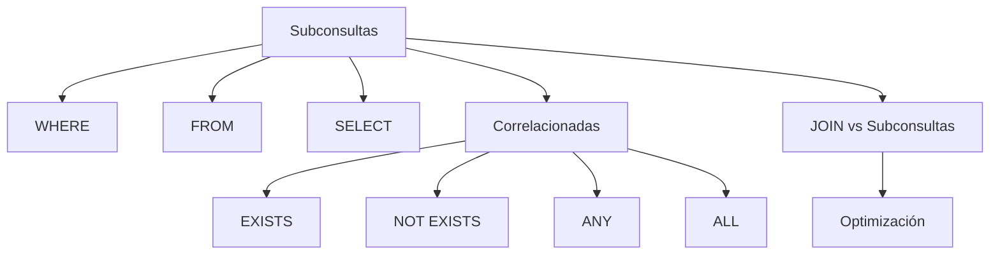

# Resumen

## Introducción

Con esta clase hemos incorporado una de las herramientas más potentes del lenguaje SQL.

Las subconsultas permiten dividir problemas complejos en consultas más pequeñas y reutilizar el resultado de unas consultas dentro de otras.

Junto con los `JOIN`, constituyen la base del SQL avanzado y aparecen continuamente en aplicaciones empresariales, sistemas de información y herramientas de análisis de datos.

---

## Resumen de la clase

Comenzamos estudiando por qué aparecen las subconsultas y vimos que muchas preguntas no pueden resolverse únicamente mediante `JOIN`.

A continuación aprendimos a construir ​**subconsultas simples**​, entendiendo que MySQL ejecuta primero la consulta interna y posteriormente utiliza su resultado en la consulta principal.

Después analizamos las distintas ubicaciones posibles:

* en `WHERE`, para filtrar registros;
* en `FROM`, creando tablas derivadas temporales;
* en `SELECT`, generando columnas calculadas.

Posteriormente estudiamos las ​**subconsultas correlacionadas**​, cuyo resultado depende de cada fila procesada por la consulta principal.

También aprendimos a utilizar operadores específicos para trabajar con conjuntos de resultados:

* `EXISTS`;
* `NOT EXISTS`;
* `ANY`;
* `ALL`.

Finalmente comparamos el uso de subconsultas y `JOIN`, resolvimos un caso práctico completo y analizamos diversas recomendaciones de optimización y los errores más habituales.

---

## Mapa conceptual

---

## Competencias adquiridas

Al finalizar esta clase el estudiante es capaz de:

* comprender cuándo es necesario utilizar una subconsulta;
* escribir subconsultas simples;
* utilizar subconsultas en `WHERE`, `FROM` y `SELECT`;
* construir subconsultas correlacionadas;
* utilizar correctamente `EXISTS` y `NOT EXISTS`;
* aplicar los operadores `ANY` y `ALL`;
* decidir cuándo utilizar una subconsulta y cuándo un `JOIN`;
* escribir consultas más claras y fáciles de mantener;
* aplicar criterios básicos de optimización.

---

## Relación con los contenidos anteriores

Las subconsultas complementan todos los conocimientos adquiridos hasta ahora.

Ya dominamos:

* creación de bases de datos;
* definición de tablas;
* restricciones;
* inserción y modificación de datos;
* consultas básicas;
* funciones de agregación;
* agrupaciones;
* `JOIN`.

Las subconsultas permiten combinar todos esos elementos para resolver problemas de una complejidad mucho mayor.

---

## Relación con la siguiente clase

Hasta ahora hemos trabajado siempre directamente sobre las tablas.

Sin embargo, en muchas aplicaciones es conveniente **guardar consultas complejas con un nombre** para reutilizarlas posteriormente.

Para ello estudiaremos las ​**vistas (`VIEW`)**​.

Aprenderemos a:

* crear vistas;
* modificarlas;
* consultarlas;
* comprender sus ventajas;
* conocer sus limitaciones;
* utilizarlas para simplificar consultas complejas y mejorar la seguridad.

Las vistas constituyen un paso natural después de dominar las subconsultas.

---

## Ideas clave

* Las subconsultas permiten utilizar el resultado de una consulta dentro de otra.
* Pueden aparecer en `WHERE`, `FROM` y `SELECT`.
* Las subconsultas correlacionadas dependen de la fila procesada por la consulta principal.
* `EXISTS` y `NOT EXISTS` son herramientas fundamentales para comprobar la existencia o ausencia de registros relacionados.
* `ANY` y `ALL` permiten comparar un valor con conjuntos completos de resultados.
* Las subconsultas y los `JOIN` son herramientas complementarias; dominar ambas permite resolver la mayoría de las consultas SQL de nivel profesional.
* Con esta clase el estudiante dispone ya de una base sólida para abordar temas más avanzados como vistas, procedimientos almacenados y optimización de consultas.

