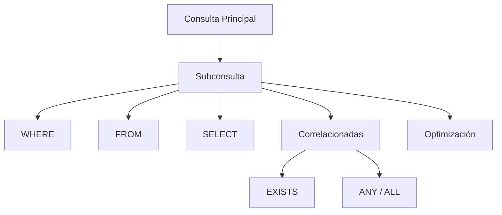

# Clase 20. SQL Avanzado: Subconsultas

## Introducción

En la clase anterior aprendimos a combinar información procedente de múltiples tablas mediante los distintos tipos de `JOIN`.

Sin embargo, existen problemas que no pueden resolverse únicamente uniendo tablas.

Por ejemplo:

* ¿Qué empleados venden por encima de la media?
* ¿Qué productos tienen un precio superior al promedio?
* ¿Qué clientes han realizado el pedido más caro?
* ¿Qué categorías contienen el producto más costoso?
* ¿Qué alumnos obtuvieron la máxima nota de su clase?

En todos estos casos necesitamos **calcular primero un resultado** y utilizarlo posteriormente para filtrar o construir otra consulta.

Aquí aparecen las ​**subconsultas**​.

Una subconsulta es, simplemente, una consulta SQL que se ejecuta dentro de otra consulta.

Aunque el concepto parece sencillo, las subconsultas permiten construir consultas extremadamente potentes y constituyen una de las herramientas más importantes del lenguaje SQL.

Durante esta sesión aprenderemos a utilizar subconsultas en distintas partes de una sentencia SQL, compararemos su uso con los `JOIN` y estudiaremos técnicas básicas de optimización.

---

## Objetivos

Al finalizar esta clase el estudiante será capaz de:

* comprender por qué aparecen las subconsultas;
* construir subconsultas simples;
* utilizar subconsultas dentro de `WHERE`;
* utilizar subconsultas en `FROM`;
* utilizar subconsultas en `SELECT`;
* comprender el funcionamiento de las subconsultas correlacionadas;
* utilizar correctamente `EXISTS`;
* utilizar `NOT EXISTS`;
* comprender los operadores `ANY` y `ALL`;
* decidir cuándo utilizar un `JOIN` y cuándo una subconsulta;
* aplicar técnicas básicas de optimización.

---

## Índice

1. [¿Por qué surgen las subconsultas?](01_por_que_surgen_las_subconsultas.md)
2. [Subconsultas simples](02_subconsultas_simples.md)
3. [Subconsultas en WHERE](03_subconsultas_en_where.md)
4. [Subconsultas en FROM](04_subconsultas_en_from.md)
5. [Subconsultas en SELECT](05_subconsultas_en_select.md)
6. [Subconsultas correlacionadas](06_subconsultas_correlacionadas.md)
7. [EXISTS](07_exists.md)
8. [NOT EXISTS](08_not_exists.md)
9. [ANY](09_any.md)
10. [ALL](10_all.md)
11. [Subconsultas vs JOIN](11_subconsultas_vs_join.md)
12. [Caso práctico completo](12_caso_practico_completo.md)
13. [Optimización básica](13_optimizacion_basica.md)
14. [Errores frecuentes](14_errores_frecuentes.md)
15. [Resumen](15_resumen.md)

---

## Metodología

Toda la clase se desarrollará ejecutando consultas directamente sobre **MySQL** utilizando **MySQL Workbench** y ​**phpMyAdmin**​.

Cada nuevo tipo de subconsulta seguirá la misma estructura:

1. Problema a resolver.
2. Consulta tradicional.
3. Solución mediante subconsulta.
4. Explicación paso a paso.
5. Casos de uso reales.
6. Errores frecuentes.
7. Buenas prácticas.

---

## Mapa conceptual

---

## Relación con la siguiente unidad

El dominio de las subconsultas permitirá comprender posteriormente:

* vistas (`VIEW`);
* procedimientos almacenados;
* funciones;
* disparadores (​*Triggers*​);
* optimización avanzada de consultas.

Las subconsultas constituyen uno de los pilares del SQL profesional.

