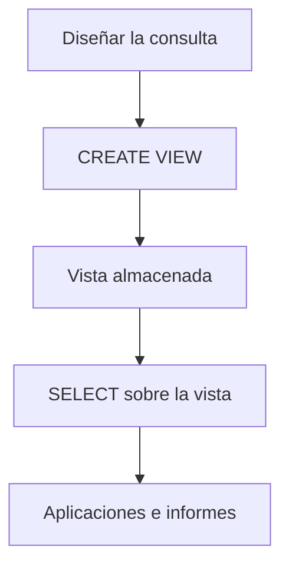
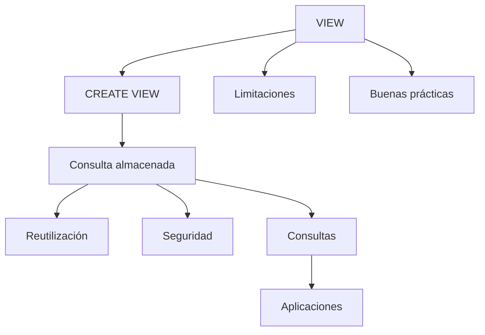

# Resumen

## Introducción

En esta clase hemos estudiado las ​**vistas (VIEW)**​, uno de los mecanismos más utilizados en bases de datos relacionales para simplificar consultas, reutilizar código SQL y ofrecer diferentes representaciones de la información almacenada.

Aunque las vistas se utilizan mediante consultas `SELECT` igual que una tabla, internamente funcionan de forma diferente y constituyen una herramienta fundamental en el desarrollo profesional de aplicaciones.

---

## Resumen de la clase

Comenzamos comprendiendo qué es una vista y cómo se diferencia de una tabla.

Aprendimos que:

* una tabla almacena datos;
* una vista almacena una consulta.

Posteriormente estudiamos las razones por las que las vistas son tan utilizadas en proyectos reales:

* evitar código duplicado;
* simplificar consultas complejas;
* facilitar el mantenimiento;
* mejorar la seguridad.

Después aprendimos a crear vistas utilizando:

```sql
CREATE VIEW
```

y vimos que, una vez creadas, pueden consultarse exactamente igual que cualquier otra tabla.

También analizamos distintos tipos de vistas:

* vistas de consulta;
* vistas utilizadas para seguridad;
* vistas actualizables.

Posteriormente estudiamos sus limitaciones, cómo reutilizar consultas mediante vistas y el papel que desempeñan dentro de aplicaciones empresariales.

Finalmente resolvimos un caso práctico completo y revisamos las principales recomendaciones y errores frecuentes.

---

## Flujo de trabajo

El ciclo habitual de trabajo con vistas puede resumirse así:



---

## Competencias adquiridas

Al finalizar esta clase el estudiante es capaz de:

* comprender qué es una vista;
* diferenciar una vista de una tabla;
* crear vistas mediante `CREATE VIEW`;
* consultar vistas como si fueran tablas;
* reutilizar consultas complejas;
* utilizar vistas para mejorar la seguridad;
* identificar cuándo una vista es actualizable;
* reconocer las limitaciones de las vistas;
* aplicar buenas prácticas en proyectos profesionales.

---

## Relación con clases anteriores

Las vistas integran prácticamente todos los conocimientos adquiridos hasta ahora.

Durante las clases anteriores aprendimos:

* DDL (`CREATE`, `ALTER`);
* DML (`INSERT`, `UPDATE`, `DELETE`);
* consultas `SELECT`;
* funciones;
* agrupaciones;
* `JOIN`;
* subconsultas.

Las vistas permiten encapsular toda esa lógica para reutilizarla de una forma mucho más sencilla.

---

## Relación con la siguiente clase

Hasta ahora nos hemos centrado principalmente en ​**escribir consultas correctas**​.

Sin embargo, una consulta correcta no siempre es una consulta rápida.

En la siguiente clase estudiaremos uno de los mecanismos más importantes para mejorar el rendimiento de una base de datos:

* ​**Índices (`INDEX`)**​.

Aprenderemos:

* qué es un índice;
* cómo funciona internamente;
* cuándo mejora el rendimiento;
* cuándo puede perjudicarlo;
* cómo crear y eliminar índices;
* cómo interpretar su impacto sobre las consultas.

Este tema supone el primer paso hacia la optimización profesional de bases de datos.

---

## Mapa conceptual



---

## Ideas clave

* Una vista es una consulta almacenada con un nombre.
* Se utiliza igual que una tabla mediante `SELECT`.
* No almacena datos propios; obtiene la información de las tablas originales.
* Facilita la reutilización del código SQL y simplifica consultas complejas.
* Es una herramienta muy útil para mejorar la seguridad mostrando únicamente la información necesaria.
* Algunas vistas son actualizables, mientras que otras son exclusivamente de lectura.
* Las vistas forman parte del trabajo diario de administradores de bases de datos y desarrolladores.
* Su utilidad aumenta considerablemente en proyectos medianos y grandes, donde simplifican el mantenimiento y reducen la duplicación de código.

---

## Conclusión

Con esta clase finaliza el bloque dedicado al ​**SQL avanzado orientado a la consulta de datos**​.

A partir de este punto comenzaremos a estudiar técnicas destinadas a mejorar el rendimiento y la administración de bases de datos, acercándonos al trabajo que realiza un administrador de bases de datos (DBA) o un desarrollador backend en un entorno profesional.

Las vistas representan una pieza fundamental de ese ecosistema y seguirán apareciendo de forma habitual en las próximas clases.

