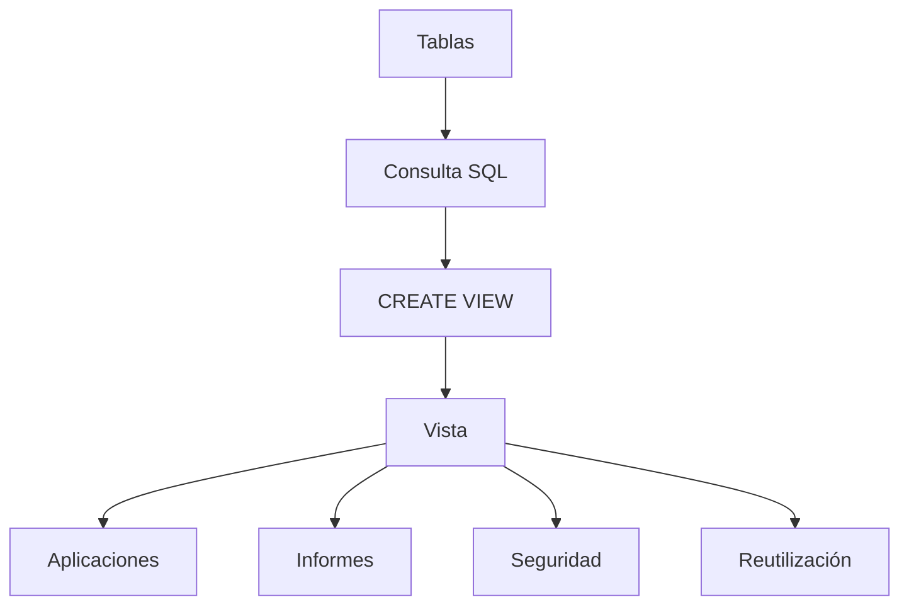

# Clase 21. SQL Avanzado: Vistas (VIEW)

## Descripción

Hasta ahora hemos aprendido a construir consultas cada vez más complejas mediante `SELECT`, funciones de agregación, `JOIN` y subconsultas. Sin embargo, muchas de esas consultas terminan reutilizándose una y otra vez en aplicaciones, informes y paneles de administración.

Las **vistas (VIEW)** permiten guardar una consulta con un nombre para utilizarla posteriormente como si fuera una tabla. Constituyen uno de los mecanismos más utilizados para simplificar el acceso a los datos, mejorar la reutilización del código y aumentar la seguridad de una base de datos.

Durante esta clase aprenderemos a crear, utilizar y administrar vistas en MySQL, comprendiendo tanto sus ventajas como sus limitaciones. Todas las consultas se ejecutarán directamente sobre la base de datos de la empresa utilizando **MySQL Workbench** y ​**phpMyAdmin**​.

---

## Objetivos de aprendizaje

Al finalizar esta clase el estudiante será capaz de:

* Comprender qué es una vista y cómo funciona internamente.
* Diferenciar una vista de una tabla física.
* Crear vistas mediante `CREATE VIEW`.
* Consultar vistas igual que cualquier otra tabla.
* Reutilizar consultas complejas mediante vistas.
* Utilizar vistas para restringir el acceso a determinados datos.
* Comprender qué vistas pueden actualizarse y cuáles no.
* Identificar las principales limitaciones de las vistas.
* Aplicar buenas prácticas en proyectos reales.

---

## Índice de contenidos

* [01. ¿Qué es una vista?](01_que_es_una_vista.md)
* [02. ¿Por qué utilizar vistas?](02_por_que_utilizar_vistas.md)
* [03. CREATE VIEW](03_create_view.md)
* [04. Vistas de consulta](04_vistas_de_consulta.md)
* [05. Vistas para seguridad](05_vistas_para_seguridad.md)
* [06. Vistas actualizables](06_vistas_actualizables.md)
* [07. Limitaciones](07_limitaciones.md)
* [08. Reutilización de consultas](08_reutilizacion_de_consultas.md)
* [09. Vistas en proyectos reales](09_vistas_en_proyectos_reales.md)
* [10. Caso práctico empresa](10_caso_practico_empresa.md)
* [11. Buenas prácticas](11_buenas_practicas.md)
* [12. Errores frecuentes](12_errores_frecuentes.md)
* [13. Resumen](13_resumen.md)

---

## Caso práctico

Continuaremos utilizando la base de datos de la empresa desarrollada durante las clases anteriores.

Crearemos vistas sobre tablas como:

* Cliente
* Pedido
* DetallePedido
* Producto
* Categoría
* Empleado

Las utilizaremos para generar informes, ocultar información sensible, simplificar consultas complejas y reutilizar código SQL.

---

## Prácticas de la sesión

Durante la clase los estudiantes ejecutarán SQL para:

* crear vistas;
* consultar vistas;
* aplicar filtros sobre vistas;
* combinar vistas con tablas;
* actualizar vistas sencillas;
* comprobar cuándo una vista deja de ser actualizable;
* eliminar vistas;
* reutilizar vistas en nuevas consultas.

Todo el código se ejecutará directamente sobre MySQL utilizando **MySQL Workbench** y ​**phpMyAdmin**​.

---

## Relación con clases anteriores

Las vistas aprovechan todos los conocimientos adquiridos hasta ahora:

* SELECT
* Funciones
* GROUP BY
* HAVING
* JOIN
* Subconsultas

En lugar de volver a escribir consultas complejas, podremos almacenarlas y reutilizarlas con un simple `SELECT`.

---

## Relación con próximas clases

Las vistas serán una herramienta habitual cuando estudiemos:

* Índices.
* Optimización de consultas.
* Procedimientos almacenados.
* Triggers.
* Usuarios y permisos.

Su conocimiento será fundamental para comprender el desarrollo profesional de aplicaciones basadas en bases de datos.

---

## Esquema conceptual

