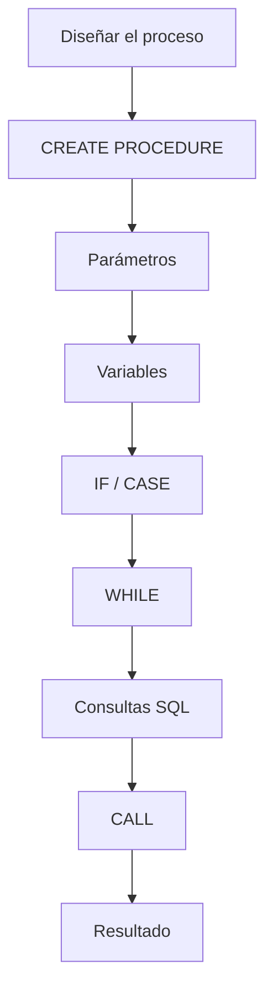
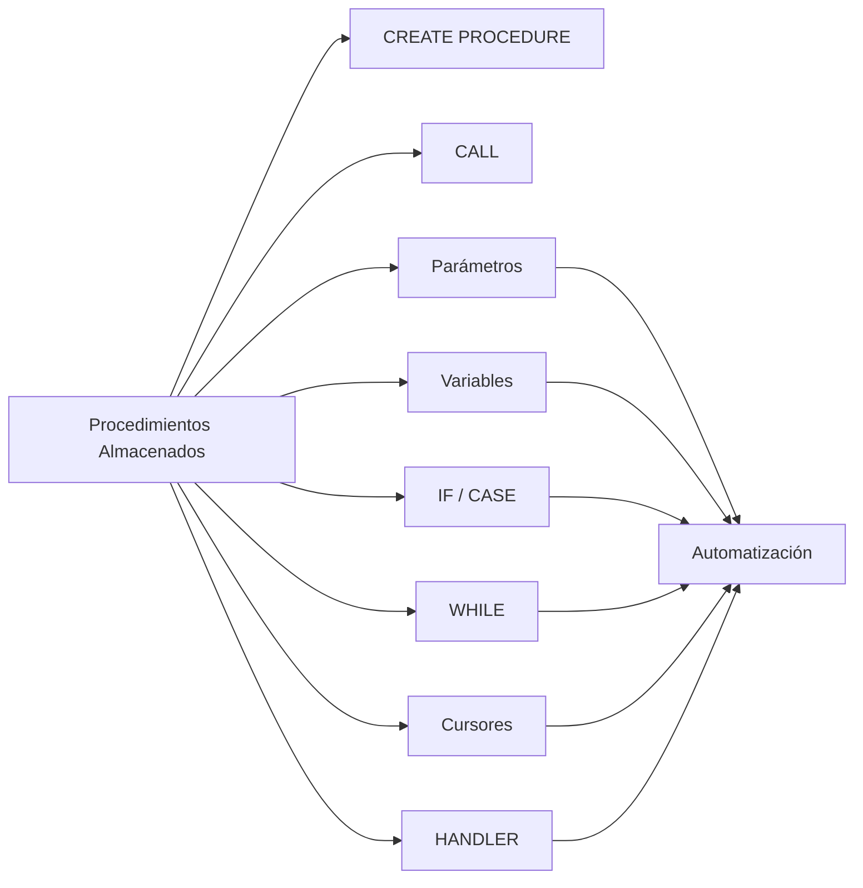

# Resumen

## Introducción

En esta clase hemos dado un paso importante en el aprendizaje de SQL al incorporar **programación procedimental** dentro de MySQL.

Hasta ahora habíamos utilizado SQL principalmente como un lenguaje declarativo para consultar y modificar datos. Con los procedimientos almacenados hemos aprendido que también es posible construir pequeños programas que se ejecutan directamente en el servidor de bases de datos.

Este cambio de enfoque nos acerca al funcionamiento de muchas aplicaciones empresariales reales.

---

## Resumen de la clase

Comenzamos comprendiendo qué es un procedimiento almacenado y por qué una única consulta SQL no siempre es suficiente para resolver procesos complejos.

Posteriormente aprendimos a crear procedimientos mediante:

```sql
CREATE PROCEDURE
```

y a ejecutarlos utilizando:

```sql
CALL
```

A continuación estudiamos cómo recibir información mediante **parámetros de entrada (`IN`)** y cómo devolver resultados utilizando ​**parámetros de salida (`OUT`)**​.

Después incorporamos ​**variables locales**​, que permiten almacenar información temporal durante la ejecución del procedimiento.

Con estas herramientas empezamos a construir algoritmos más completos utilizando:

* estructuras `IF`;
* estructuras `CASE`;
* bucles `WHILE`.

También vimos una introducción a los ​**cursores**​, comprendiendo cuándo pueden resultar útiles y por qué deben utilizarse únicamente cuando una consulta basada en conjuntos no sea suficiente.

Finalmente aprendimos a controlar errores mediante ​**manejadores (`HANDLER`)**​, desarrollamos un caso práctico empresarial y revisamos las principales buenas prácticas y errores habituales.

---

## Flujo de trabajo

El desarrollo típico de un procedimiento puede resumirse en el siguiente esquema:



---

## Competencias adquiridas

Al finalizar esta clase el estudiante es capaz de:

* comprender qué es un procedimiento almacenado;
* crear procedimientos mediante `CREATE PROCEDURE`;
* ejecutar procedimientos con `CALL`;
* utilizar parámetros de entrada y salida;
* declarar variables locales;
* construir estructuras condicionales;
* utilizar bucles sencillos;
* comprender el funcionamiento básico de los cursores;
* implementar un manejo básico de errores;
* desarrollar pequeños procesos automatizados dentro de MySQL.

---

## Relación con clases anteriores

Los procedimientos almacenados integran prácticamente todos los conocimientos estudiados hasta ahora.

En ellos hemos utilizado:

* DDL;
* DML;
* consultas `SELECT`;
* funciones;
* `JOIN`;
* subconsultas;
* vistas.

En lugar de emplearlos de forma aislada, ahora somos capaces de combinarlos para automatizar procesos completos.

---

## Relación con la siguiente clase

Los procedimientos almacenados permiten ejecutar procesos completos, pero todavía existe una limitación importante.

En ocasiones necesitamos que una rutina:

* reciba parámetros;
* realice cálculos;
* **devuelva un único valor** para poder utilizarlo directamente dentro de una consulta SQL.

Ese será el objetivo de la siguiente clase, dedicada a las ​**Funciones Almacenadas (Stored Functions)**​.

Aprenderemos a:

* crear funciones mediante `CREATE FUNCTION`;
* utilizar `RETURN`;
* invocar funciones desde consultas `SELECT`;
* diferenciar claramente una función de un procedimiento;
* aplicar funciones en escenarios reales de negocio.

---

## Mapa conceptual



---

## Ideas clave

* Un procedimiento almacenado es un conjunto de instrucciones SQL almacenadas bajo un nombre.
* Se crea mediante `CREATE PROCEDURE` y se ejecuta utilizando `CALL`.
* Puede recibir parámetros de entrada (`IN`) y devolver información mediante parámetros de salida (`OUT`).
* Las variables locales permiten almacenar información temporal durante la ejecución.
* Las estructuras `IF`, `CASE` y `WHILE` incorporan lógica de programación al servidor de bases de datos.
* Los cursores permiten recorrer resultados fila a fila, aunque deben utilizarse con moderación.
* El manejo de errores mejora la robustez de los procedimientos.
* Los procedimientos almacenados constituyen una herramienta fundamental para automatizar procesos empresariales y reducir la duplicación de código.

---

## Conclusión

Con esta clase comienza el bloque de ​**programación dentro del SGBD**​, uno de los aspectos que diferencia a un usuario básico de SQL de un desarrollador o administrador de bases de datos.

Aunque en muchos proyectos parte de la lógica reside en la aplicación, conocer los procedimientos almacenados permite comprender cómo funcionan numerosos sistemas profesionales y proporciona una base sólida para estudiar funciones, triggers y transacciones en las siguientes clases del curso.

