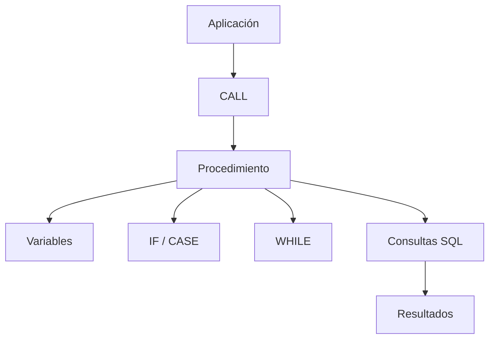

# Clase 22. SQL Avanzado: Procedimientos Almacenados

## Descripción

Hasta este momento del curso hemos trabajado principalmente con consultas SQL que se ejecutan de forma independiente. Sin embargo, muchas aplicaciones necesitan realizar tareas más complejas que no pueden resolverse con una única instrucción `SELECT`, `INSERT`, `UPDATE` o `DELETE`.

Los **procedimientos almacenados (Stored Procedures)** permiten agrupar múltiples instrucciones SQL dentro de un único objeto de la base de datos, incorporando además variables, parámetros, estructuras condicionales, bucles y manejo de errores.

Gracias a ellos es posible trasladar parte de la lógica de negocio al propio servidor de bases de datos, reduciendo la duplicación de código y mejorando la reutilización.

En esta clase aprenderemos a crear procedimientos almacenados en MySQL, ejecutarlos, recibir parámetros, devolver resultados y construir algoritmos sencillos utilizando el lenguaje procedimental que ofrece el SGBD.

Como en las clases anteriores, ​**todo el código será ejecutado directamente sobre MySQL utilizando MySQL Workbench y phpMyAdmin**​.

---

## Objetivos de aprendizaje

Al finalizar esta clase el estudiante será capaz de:

* Comprender qué es un procedimiento almacenado.
* Diferenciar un procedimiento de una consulta SQL tradicional.
* Crear procedimientos mediante `CREATE PROCEDURE`.
* Ejecutar procedimientos utilizando `CALL`.
* Utilizar parámetros de entrada y salida.
* Declarar variables locales.
* Construir estructuras condicionales.
* Utilizar estructuras repetitivas.
* Comprender el funcionamiento básico de los cursores.
* Implementar un manejo básico de errores.
* Aplicar procedimientos almacenados en un caso práctico empresarial.

---

## Conocimientos previos necesarios

Para seguir correctamente esta clase el estudiante debe dominar:

* DDL (`CREATE`, `ALTER`)
* DML (`INSERT`, `UPDATE`, `DELETE`)
* SELECT
* Funciones
* GROUP BY
* HAVING
* JOIN
* Subconsultas
* Vistas

---

## Índice de contenidos

* [01. ¿Qué es un procedimiento?](01_que_es_un_procedimiento.md)
* [02. ¿Por qué no todo es SQL?](02_por_que_no_todo_es_sql.md)
* [03. CREATE PROCEDURE](03_create_procedure.md)
* [04. Parámetros de entrada](04_parametros_de_entrada.md)
* [05. Parámetros de salida](05_parametros_de_salida.md)
* [06. Variables locales](06_variables_locales.md)
* [07. Estructuras IF](07_estructuras_if.md)
* [08. CASE](08_case.md)
* [09. Bucles WHILE](09_bucles_while.md)
* [10. Cursores: introducción](10_cursores_introduccion.md)
* [11. Manejo de errores](11_manejo_de_errores.md)
* [12. Caso práctico empresa](12_caso_practico_empresa.md)
* [13. Buenas prácticas](13_buenas_practicas.md)
* [14. Errores frecuentes](14_errores_frecuentes.md)
* [15. Resumen](15_resumen.md)

---

## Caso práctico

Continuaremos trabajando sobre la base de datos de la empresa desarrollada durante el curso.

Crearemos procedimientos para:

* registrar pedidos;
* actualizar stock;
* calcular estadísticas;
* validar información;
* automatizar tareas repetitivas.

---

## Prácticas de la sesión

Durante la clase los estudiantes ejecutarán SQL para:

* crear procedimientos;
* modificarlos;
* ejecutarlos mediante `CALL`;
* enviar parámetros;
* recuperar parámetros de salida;
* utilizar variables;
* crear estructuras `IF`;
* utilizar `CASE`;
* construir bucles `WHILE`;
* gestionar errores sencillos.

Todo el código será ejecutado directamente sobre MySQL.

---

## Relación con clases anteriores

Hasta ahora el estudiante ha aprendido a consultar y modificar datos.

Los procedimientos almacenados permiten combinar todas esas operaciones dentro de pequeños programas ejecutados directamente por el servidor de bases de datos.

---

## Relación con próximas clases

Los procedimientos almacenados constituyen la base para comprender posteriormente:

* funciones almacenadas;
* triggers;
* transacciones;
* optimización de procesos;
* desarrollo de aplicaciones empresariales.

---

## Esquema conceptual

